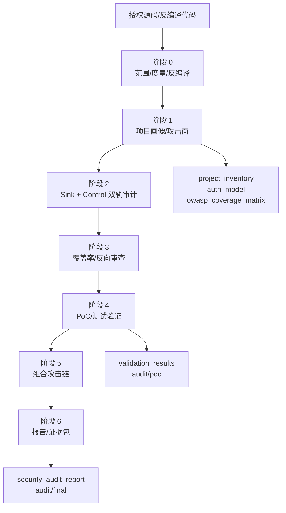

# code-security-audit

面向有源码白盒场景的 LLM 代码安全审计 skill。它把 LLM 约束为工程化审计流水线：先输出项目架构画像，再按 OWASP/ASVS/WSTG/CWE 建立覆盖矩阵，之后执行双轨审计、PoC/测试验证、组合漏洞分析和最终合规报告。

## 核心目标

1. 输出项目基础架构：目录结构、开发语言、框架、中间件、数据库、依赖、入口、鉴权与授权逻辑。
2. 按 OWASP ASVS/WSTG/Top 10 和 CWE 建立覆盖矩阵，避免只审模型容易想到的漏洞。
3. 同时执行 Sink-driven 与 Control-driven 审计，覆盖注入、反序列化、SSRF、文件漏洞、认证绕过、越权、IDOR/BOLA、多租户隔离和业务逻辑。
4. 对 finding 执行 V0-V4 验证分级；优先使用用户测试环境，没有测试环境时生成最小化单元或集成测试。
5. 输出最终报告与可复核证据包，而不是只给不可追溯的漏洞摘要。

## 工程架构



详细架构见 `shared/architecture_design.md`，研究依据见 `shared/research_basis.md`。

## 目录结构

```text
code-security-audit/
├── SKILL.md
├── README.md
├── shared/
│   ├── architecture_design.md
│   ├── research_basis.md
│   ├── whitebox_audit_schema.md
│   ├── phase_definitions.md
│   ├── anti_hallucination.md
│   ├── verification_principles.md
│   ├── report_fields.md
│   ├── composite_vulnerability_analysis.md
│   ├── audit_output_layout.md
│   ├── coverage_matrix_template.md
│   ├── scope_policy.md
│   ├── dimensions.md
│   ├── large_project_audit.md
│   ├── decompilation.md
│   ├── config/
│   └── tools/
├── skills/
│   ├── audit-recon/
│   ├── audit-sink/
│   ├── audit-control/
│   ├── audit-validate/
│   └── audit-report/
└── scripts/
```

## 审计流程

```text
阶段 0 范围/度量/反编译
-> 阶段 1 项目画像/攻击面/覆盖矩阵
-> 阶段 2 Sink-driven + Control-driven 全量审计
-> 阶段 3 覆盖率校验 + finding-skeptic
-> 阶段 4 V0-V4 验证 + PoC/测试 + CVSS
-> 阶段 5 组合漏洞与攻击链
-> 阶段 6 最终报告与证据包
```

## 关键产物

| 产物 | 说明 |
|------|------|
| `audit/phase1/project_inventory.json` | 项目语言、框架、依赖、数据存储、入口和安全控制 |
| `audit/phase1/architecture_inventory.md` | 模块结构、数据流、信任边界和高价值资产 |
| `audit/phase1/auth_model.md` | 认证、会话、授权、租户隔离和拦截链 |
| `audit/phase1/owasp_coverage_matrix.md` | OWASP/ASVS/WSTG/CWE 覆盖矩阵 |
| `audit/phase4/validation_results.json` | V0-V4 验证等级、命令、结果和限制 |
| `audit/poc/` | PoC、单测、集成测试或 E2E 验证材料 |
| `audit/security_audit_report.md` | 最终合规报告 |
| `audit/final/` | 可复核证据包 |

## 使用方式

对 AI 说「开始审计」或「对 XXX 项目做安全审计」即可启动。若审计中断，说「继续审计」会从已落盘产物恢复。
