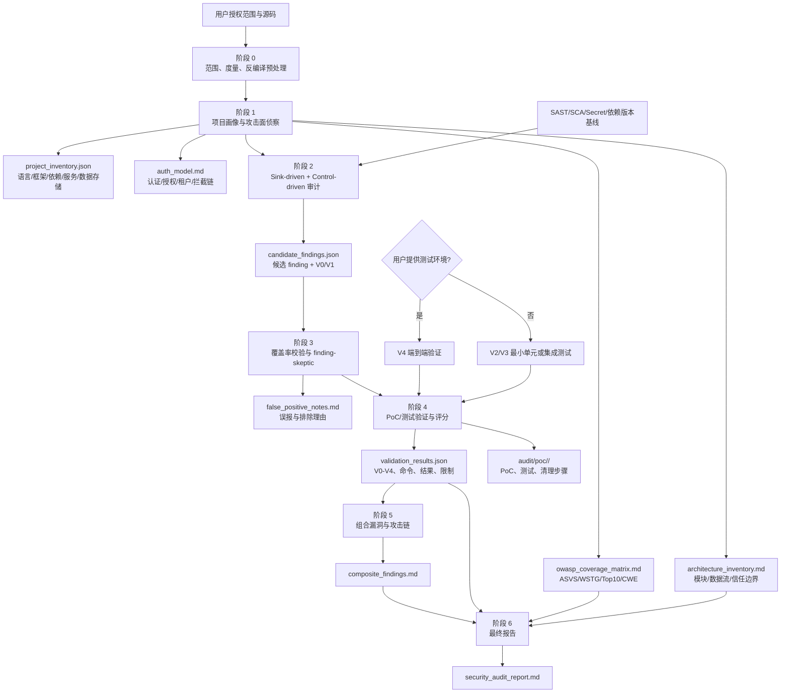
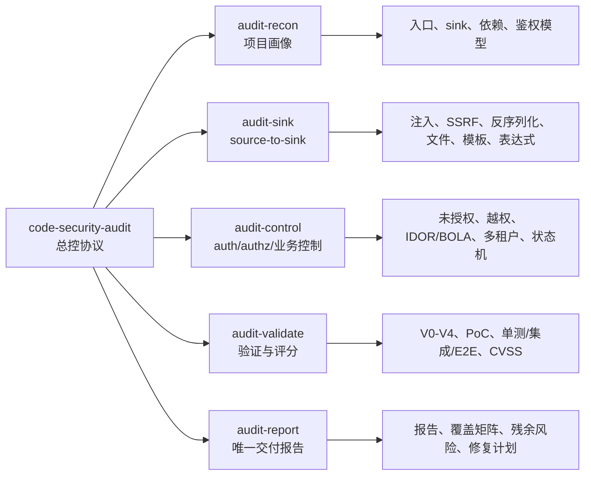
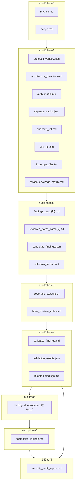

# LLM 白盒代码审计工程架构设计

本文定义 `code-security-audit` 的工程化架构。核心目标是把 LLM 从“单轮问答式找洞”约束为可追溯、可验证、可复盘的白盒审计流水线。

## 1. 总体流水线

## 2. Skill 模块架构

## 3. 数据产物架构

## 4. 工程原则

| 原则 | 设计含义 |
|------|----------|
| LLM 是编排器，不是唯一裁决器 | LLM 负责语义理解、跨文件追踪、报告组织；最终 finding 必须有代码证据和验证等级 |
| 画像先于找洞 | 不先明确语言、框架、鉴权、依赖、入口、数据存储，就无法判断漏洞是否可达 |
| 标准覆盖先于结果数量 | 用 OWASP ASVS/WSTG/Top 10/CWE 建立覆盖矩阵，避免只输出模型容易想到的漏洞 |
| 候选与漏洞分离 | 阶段 2 产出 candidate，阶段 4 验证后才可进入 final report |
| 反向审查必须存在 | finding-skeptic 检查全局鉴权、框架默认保护、ORM 参数化、schema validation 和不可达代码 |
| 测试环境优先 | 用户提供测试环境时做 V4；没有测试环境时用最小化单元/集成测试做 V2/V3 |
| 唯一交付报告 | 最终报告必须内联关键证据、复现细节和修复建议，不能要求读者跳转中间文件理解漏洞 |

## 5. 与传统 SAST 的分工

| 能力 | SAST/SCA/Secret 工具 | LLM 白盒审计 |
|------|----------------------|--------------|
| 依赖漏洞 | 强 | 用于确认版本、影响路径和修复建议 |
| 简单 sink 模式 | 强 | 用于过滤误报、追踪业务上下文 |
| 跨文件业务逻辑 | 弱到中 | 强，但必须验证 |
| 鉴权/越权/租户隔离 | 弱到中 | 强，尤其适合读拦截器、权限表、资源归属 |
| PoC/测试生成 | 弱 | 强，但必须在授权环境中执行 |
| 可审计报告 | 中 | 强，适合整合证据、标准映射和残余风险 |

结论：最佳工程形态不是“LLM 替代 SAST”，而是 **SAST/SCA/Secret 生成基线 + LLM 做项目级语义审计 + 测试验证收敛误报**。
